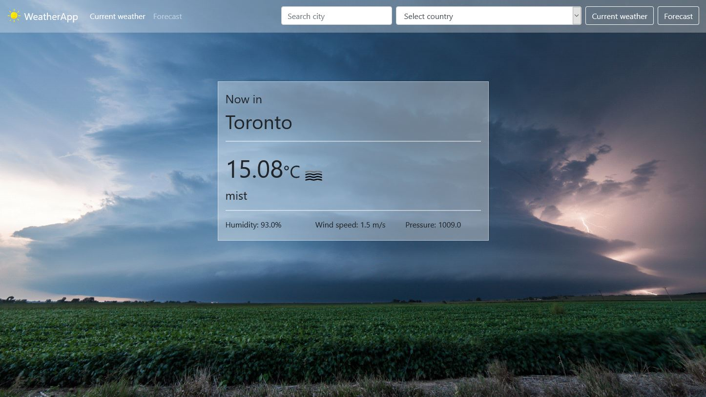
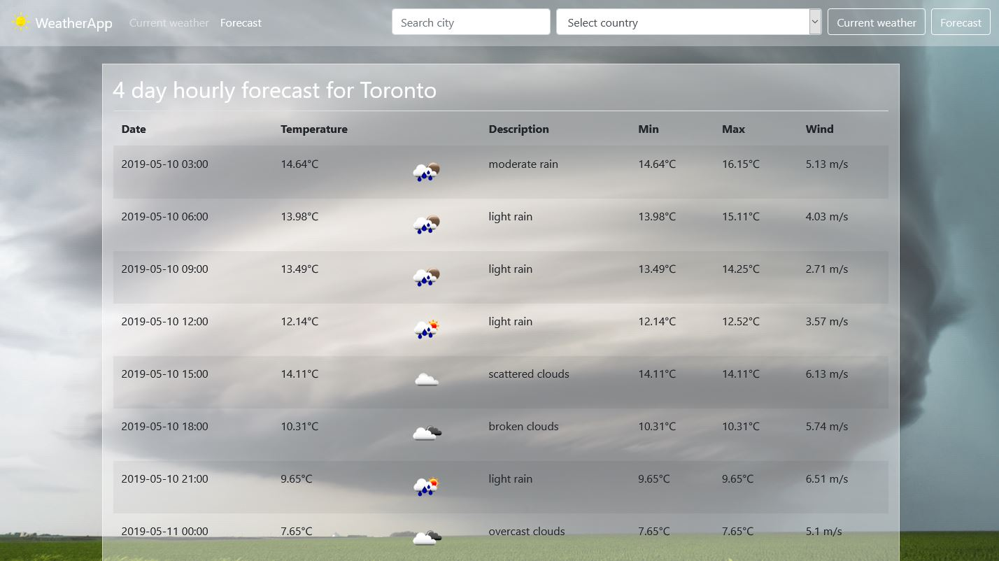

# Weather Application

## Description

A weather web application that shows current weather and a forecast for a searched location.

This is a Spring Boot RESTful application that uses an external weather API.

## Application

Current weather:

 

Forecast:

 

## Credits

Weather API provided by: https://openweathermap.org/

Background images: https://stormandsky.com/

